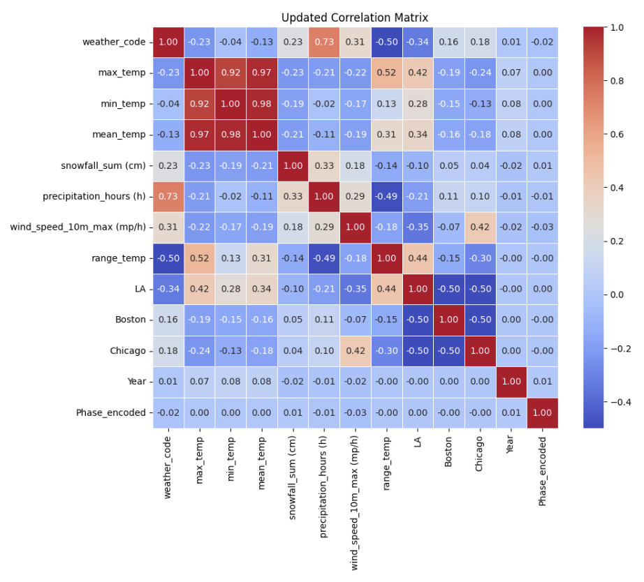
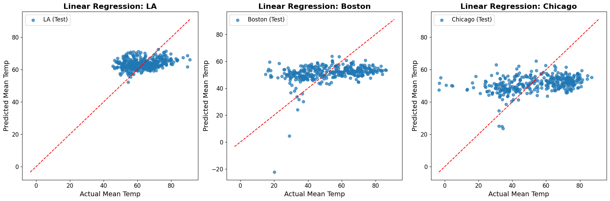
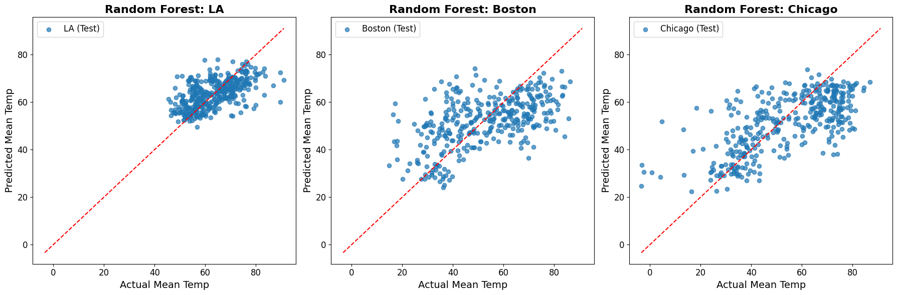
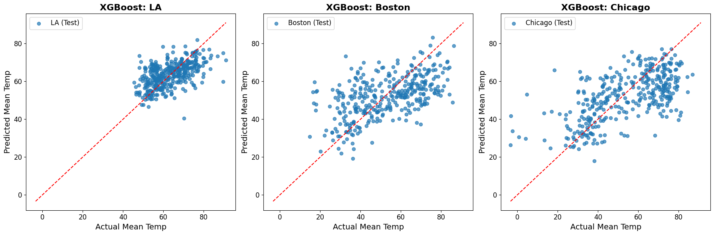
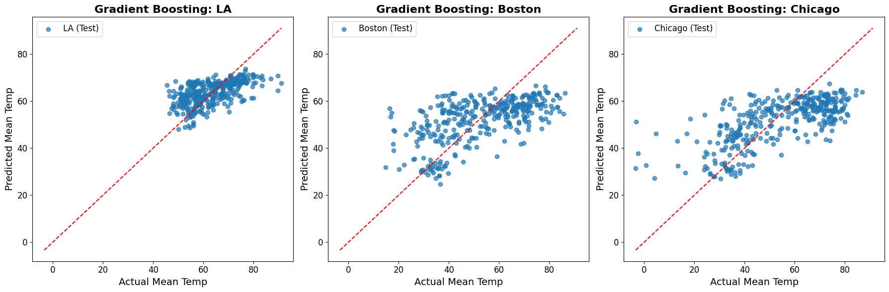
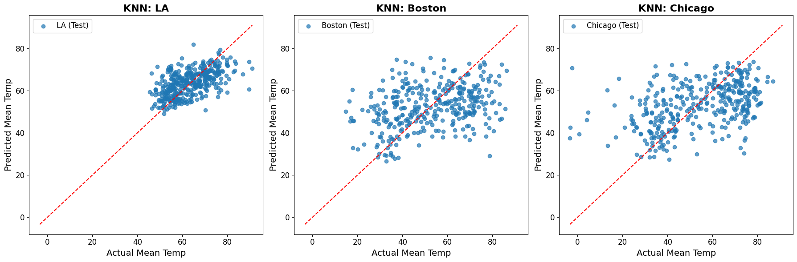
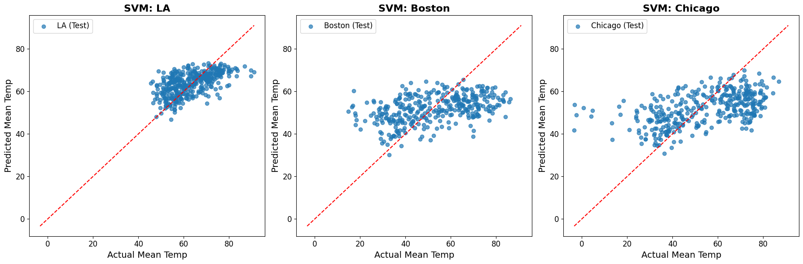
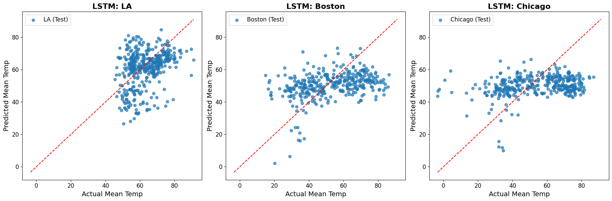

# Exploring the Connection Between Moon Phases and Weather Data to Predict Temperature 
**Project Description:**
  This project aims to investigate the relationship between the moon phases and fluctuations in weather patterns specifically focusing on temperature anomalies. By using historical weather data from varying weather stations, this project will explore whether moon phases can predict temperature anomolies. 

**Goals:**
  The main goal of this project is to develop a model capable of predicting temperature anomalies based on the moon phases and other meterological factors. Some other goals include gathering and analying past weather data including temperature, humidity, wind speed, and possibly other meteorological factors, and building a predictive model that can assess temperature deviations using the moon phase. 

**Data Collection:**
  We will be using web scaping techniques to pull historical weather data from sources like Wunderground or NOAA. Historical moon phase information will be collected from APIs such as the US Naval Observatory or Sunrise=Sunset.org. We will be collecting lunar phases for each date and time in the weather data set. 

**Data Modeling:**
  We will be using a linear regression model to understand the relationship between moon phases and temperature deviations. We are open to exploring more modeling techniques to find one that best fits our data. 

**Data Visualization:**
  To visualize the relationship between moon phases and temperature anomalies, we plan to use a scatter plot. Once again, we're open to exploring different methods of visualization to find the best fit method for our data. 

**Test Plan:**
  Data collected from earlier periods will be used to train the model. The weather data from May to October will be used for training. Data collected in November and December will be reserved for testing to evaluate the model's predictions. 

---

# Final Report

(Please see pdf version for visuals)

## **Introduction**

This project seeks to explore the potential relationship between moon phases and fluctuations in weather patterns, aiming to assess whether lunar cycles—specifically the different phases of the moon—can serve as reliable predictors for various meteorological variables, including temperature, precipitation, and wind speed. For centuries, people have speculated about the influence of the moon on the Earth's weather systems, with many traditional beliefs linking the lunar cycle to patterns in nature, human behavior, and even environmental changes. The moon’s gravitational pull is well-known for influencing tides and ocean currents, but its potential effects on weather, particularly atmospheric phenomena, remain less understood and have been subject to both scientific inquiry and folklore.
This study builds on the hypothesis that the moon's gravitational forces and associated cycles could have a subtle, yet measurable, impact on weather patterns. The primary goal is to systematically examine whether the phases of the moon—the new moon, first quarter, full moon, and last quarter—are associated with any observable fluctuations in key weather variables such as temperature, precipitation, and wind speed. To test this hypothesis, we have focused on three cities with varying climates and geographical contexts: Chicago, IL, Los Angeles, CA, and Boston, MA. Each of these cities represents a distinct climate type—Chicago with its continental climate, Los Angeles with its mild Mediterranean climate, and Boston with its coastal, seasonal climate. By examining these diverse locations, we aim to determine whether the lunar influence on weather is universal or region-specific, offering a more comprehensive understanding of the potential relationship between moon phases and atmospheric conditions.

### Data Collection

The data cleaning process involved several key steps to prepare the datasets for analysis. Weather data was sourced from the Open-Meteo API, covering the period from October 29, 2019, to October 29, 2024. This dataset includes daily minimum and maximum temperatures (in °F), total precipitation (in mm), maximum wind speed (in mph), maximum wind gusts (in mph), and weather code for three cities: Los Angeles, Chicago, and Boston. Simultaneously, moon phase data was obtained from the USNO Astronomical Application API, spanning the same timeframe and detailing the different moon phases (New Moon, First Quarter, Full Moon, Last Quarter), along with their corresponding dates and times in Universal Time (UT). To create a comprehensive dataset, we combined the moon phase data with the weather data for each city based on matching dates. Additionally, we computed and added two new columns—range and mean temperatures (in °F)—to enhance the dataset for further analysis.

### **How to Build and Run the Code**

This section outlines the steps required to set up the environment, install dependencies, prepare data, and execute the code for the project.
1. _Set Up Your Environment_
To ensure consistent execution, follow these steps to set up your environment:
	1. Install Python 3.9 or a later version.
	2. Create a virtual environment to manage dependencies:
		python -m venv env
		source env/bin/activate  # For Linux/MacOS
		env\Scripts\activate     # For Windows

2. _Install Dependencies_
Install all required libraries using the pip package manager. You can use a Makefile to automate this step.
	Run the following command to install dependencies:
			make install
   
4. _Dependencies File_ 

Ensure the following dependencies are listed in a requirements.txt file in the project directory:
	pandas
	numpy
	matplotlib
	scikit-learn
	xgboost
	tensorflow
	seaborn
	pytest

4. Data Preparation
Place the cleaned weather dataset (cleaned_weather_data.csv) in the appropriate directory within the project. By default, the dataset should be in the folder final_report_data/.

5. Running the Code
    To execute the program, use the following command:
make run

## **Data Cleaning and Processing**

The data cleaning process started with adding the moon phases data to each city’s dataset. Since the moon phase data only included the main phases—new moon, first quarter, full moon, and last quarter—additional in-between phases were added to ensure we could include as much weather data as possible. Afterward, the datasets for each city were combined, with three new columns titled 'LA', 'Boston', and 'Chicago' to indicate which city each row belonged to, using 1 for the respective city and 0 otherwise. The moon phases were then encoded as numbers to make them easier to work with in the model.

### **Feature Selection**

The exact date was simplified to only include the year, as using the full date would have made the model too dependent on it rather than focusing on the moon phases. Non-numeric columns like 'Time (UT)', 'sunset (iso8601)', and 'sunrise (iso8601)' were removed as well. Looking through the remaining columns, some seemed redundant or overly correlated with temperature, so several were dropped, including 'daylight_duration (s)', 'sunshine_duration (s)', 'shortwave_radiation_sum (MJ/m²)', 'reference_evapotranspiration (mm)', 'wind_gusts_10m_max (mp/h)', 'wind_direction_10m_dominant (°)', 'precipitation_sum (mm)', and 'rain_sum (mm)'.
At this point, the moon phases still showed little correlation with the weather data, but they had some slight effect on variables like wind speed, weather code, and precipitation, which might still offer insights.

## **Preliminary Analysis**

Looking at the initial statistics, the differences between the cities are clear: Los Angeles has higher average temperatures and a more stable climate, while Boston and Chicago show larger seasonal changes, with more extreme temperatures and wind speeds. The moon phases are evenly distributed, making it easy to compare their potential effects.

Looking more closely at the relationship between moon phases and temperature, Los Angeles has less variance in temperatures compared to Boston and Chicago. However, there isn’t a noticeable difference in temperatures based on moon phases, suggesting that they don’t have a direct impact on the temperature. Chicago had the widest range of wind speeds, while Los Angeles portrayed the smallest range of wind speeds. The moon phases don’t seem to significantly influence these patterns since the ranges and median values for wind speed stay fairly consistent regardless of the phase. 

The data suggested that moon phases alone aren’t strong predictors of temperature or wind speed. Instead, other factors like seasonal changes and geographical differences seem to play a bigger role. We used further analysis, like statistical tests to check for significant differences between moon phases, exploring how moon phases interact with other weather variables, such as precipitation or extreme conditions. These early observations and understanding whether moon phases contribute in smaller, less obvious ways to weather patterns.

## **Initial Model Testing**

To determine which machine learning models would be most effective for our dataset, we conducted an initial model fit across eight different algorithms. The models were evaluated using a range of performance metrics: Mean Squared Error (MSE), R-squared (R²), and Adjusted R-squared (Adj-R²). These metrics provided insight into how well each model captured the underlying patterns in the data and how suitable each was for further analysis and hyperparameter tuning. We tested the following eight models:
	1. Linear Regression
	2. Decision Trees
	3. Random Forest
	4. XGBoost
	5. Gradient Boosting
	6. K-Nearest Neighbors (KNN)
	7. Support Vector Machine (SVM)
	8. Long Short-Term Memory (LSTM)
 
Each model was evaluated based on how well it performed in terms of the predictive accuracy (R²) and error (MSE), along with the adjusted goodness-of-fit measure (Adj-R²), which accounts for model complexity.

### _Linear Regression_

The Linear Regression model, without hyperparameter tuning, produced the following results: a Mean Squared Error (MSE) of 214.43, an R-squared (R²) of 0.16, and an Adjusted R-squared (Adj. R²) of 0.15. The MSE indicates that the model's predictions are relatively inaccurate, suggesting that there is room for improvement in model performance. With an R² of 0.16, the model explains about 16% of the variation in the target variable, which means it fails to capture the majority of the underlying patterns. The Adjusted R², which accounts for the number of predictors, is slightly lower, supporting the idea that while the model is making some progress, it could perform better with further tuning or alternative approaches.

### _Decision Trees_

The Decision Trees model, without hyperparameter tuning, produced the following results: a Mean Squared Error (MSE) of 285.5, an R-squared (R²) of -0.12, and an Adjusted R-squared (Adj. R²) of -0.13. The MSE indicates that the model fails to explain any meaningful variation in the target variable and actually performs worse than a simple mean-based model (which would have an R² of 0). This negative R² value indicates that the model is not capturing useful patterns in the data. With an R² of -0.12, the model explains about none of the variation in the target variable, which means it captures some patterns, but there's still a significant amount of variance left unexplained. The Adjusted R², which accounts for the number of predictors, is even lower, further suggesting that the inclusion of additional features has not improved the model's performance and may have even contributed to overfitting. These results indicate that the Decision Trees model requires significant tuning in order to improve predictive accuracy.

### _Random Forest_

The Random Forest model, without hyperparameter tuning, produced the following results: a Mean Squared Error (MSE) of 149.97, an R-squared (R²) of 0.41, and an Adjusted R-squared (Adj. R²) of 0.41. The MSE indicates that the model's predictions are somewhat off from the actual values, suggesting there is room for improvement in accuracy. With an R² of 0.41, the model explains about 41% of the variation in the target variable, meaning it captures some of the underlying patterns but leaves a significant portion of the variance unexplained. The Adjusted R² accounts for the number of predictors and is the same as the R² in this case. This indicates that the number of features is relatively appropriate for the given data. While the model is providing some useful insights, there is still considerable potential for improvement through further tuning of the model.

### _XGBoost_

The XGBoost model, without hyperparameter tuning, produced the following results: a Mean Squared Error (MSE) of 159.06, an R-squared (R²) of 0.38, and an Adjusted R-squared (Adj. R²) of 0.37. The MSE indicates that the model's predictions are somewhat off from the actual values, showing there's potential for improvement. With an R² of 0.38, the model explains about 38% of the variation in the target variable, which means it captures some patterns, but there's still a significant amount of variance left unexplained. The Adjusted R², which accounts for the number of predictors, is slightly lower, supporting the idea that while the model is making some progress, it could perform better with further tuning or alternative approaches.

### _Gradient Boosting_

The Gradient Boosting model, without hyperparameter tuning, produced the following results: Mean Squared Error (MSE) of 146.22, an R-squared (R²) of 0.43, and an Adjusted R-squared (Adj. R²) of 0.42. The MSE indicates that the model’s predictions are relatively close to the actual values, though there’s still some room for improvement. With an R² of 0.43, the model accounts for 43% of the variability in the target variable, suggesting that it has a moderate understanding of the data's patterns. The Adjusted R² is slightly lower, reflecting the model’s performance while accounting for the number of predictors used. Overall, while the model performs reasonably well, there is still potential for better accuracy through further optimization.

### _K-Nearest Neighbors (KNN)_

The K-Nearest Neighbors (KNN) model, without hyperparameter tuning, produced the following results: Mean Squared Error (MSE) of 202.46, an R-squared (R²) of 0.21, and an Adjusted R-squared (Adj. R²) of 0.20. The high MSE suggests that the model's predictions are quite far from the actual values, indicating a need for improvement in its predictive ability. With an R² of just 0.21, the model only explains 21% of the variation in the target variable, showing that it captures only a small portion of the underlying patterns in the data. The Adjusted R², which adjusts for the number of predictors, further reflects the model's limited explanatory power. These results highlight the potential for improving the model, whether through hyperparameter tuning or exploring alternative models.

### _Support Vector Machine (SVM)_

The Support Vector Machine model, without hyperparameter tuning, produced the following results: a Mean Squared Error (MSE) of 180.13, an R-squared (R²) of 0.30, and an Adjusted R-squared (Adj. R²) of 0.29. The MSE indicates that the model's predictions are moderately off from the actual values, suggesting there is room for improvement in predictive accuracy. With an R² of 0.30, the model explains about 30% of the variation in the target variable, meaning it captures some patterns, but still leaves a large portion of the variance unexplained. The Adjusted R², which accounts for the number of predictors, is slightly lower, further suggesting that the model is not fully utilizing the available features and could potentially benefit from additional tuning.

### _Long Short-Term Memory (LSTM)_

The Long Short-Term Memory  model, without hyperparameter tuning, produced the following results: a Mean Squared Error (MSE) of 247.11, an R-squared (R²) of 0.03, and an Adjusted R-squared (Adj. R²) of 0.03. The MSE indicates that the model's predictions are considerably off from the actual values, suggesting that there is significant room for improvement in accuracy. With an R² of 0.03, the model explains about 3% of the variation in the target variable, meaning it fails to capture most of the underlying patterns in the data. The Adjusted R², which takes into account the number of predictors, is the same as the R² in this case, highlighting that the model's complexity does not improve its explanatory power. This suggests that the LSTM model, as currently configured, is not effectively using the data and may require intensive tuning.

| Model              | MSE    | R²   | Adjusted R² |
|--------------------|--------|------|-------------|
| Linear Regression  | 214.43 | 0.16 | 0.15        |
| Decision Tree      | 285.50 | -0.12| -0.13       |
| Random Forest      | 149.97 | 0.41 | 0.41        |
| XGBoost            | 159.06 | 0.38 | 0.37        |
| Gradient Boosting  | 146.22 | 0.43 | 0.42        |
| KNN                | 202.46 | 0.21 | 0.20        |
| SVM                | 180.13 | 0.30 | 0.29        |
| LSTM               | 247.11 | 0.03 | 0.03        |

Table 1: Table displaying all of the MSE, R-Squared and Adjusted R-Squared values for each model without hyperparameter testing. The yellow highlights the top 3 models.

## **Hyperparameter Tuning**

We ran hyperparameter testing via Grid Search for our top three models– Random Forest, XGBoost, and Gradient Boosting. We tested different hyperparameter options using Grid Search since it is an exhaustive search to find the best choices for the given models.

We started with Random Forest, where we tuned 5 hyperparameters: n_estimators, max_depth, min_samples_split, min_samples_leaf, and bootstrap. We tested 50, 100, and 200 trees to find a balance between predictive performance and computational efficiency. Values of 10, 20, and 30 were chosen to explore the trade-off between underfitting (low depth) and overfitting (high depth). We explored 2, 5, and 10 to see how the number of samples required to split a node impacts model complexity and overfitting. We tested values of 1, 2, and 4 to control the minimum number of samples per leaf node and influence the model’s generalization. We considered both True and False to understand how the use of bootstrap sampling affects the model’s variance and generalization.

We next tuned hyperparameters for XGBoost. We tested 6 hyperparameters: n_estimators, learning_rate, max_depth, subsample, colsample_bytree, and gamma. Similar to Random Forest, we tested 50, 100, and 200 trees to balance model complexity with computational efficiency. We chose learning rates of 0.01, 0.05, and 0.1 to see how quickly the model converges, with lower values favoring better generalization. We chose smaller values of 3, 5, and 7 for max_depth than with Random Forest because XGBoost prefers low depth of trees to prevent overfitting. We tested 0.8 and 1.0 for subsample to see how the fraction of training samples can affect accuracy. Additionally, values of 0.8 and 1.0 were used as the fraction of features used for each tree, as we wanted to explore how the amount of features can affect both underfitting and overfitting. For gamma, we tested values of 0, 0.1, and 0.2 to explore how conservative the model should be when making tree splits.

For Gradient Boosting, we tuned 5 hyperparameters: n_estimators, learning_rate, max_depth, subsample, and min_samples_split. Like with Random Forest and XGBoost, we used 50, 100, and 200 trees to see the balance between computational efficiency and predictive performance. We also used the same learning rates as XGBoost to understand how the learning rate affects both the speed of learning and model generalization. Again, we used the same values of 3, 5, and 7 for max_depth to explore how tree complexity impacts performance. We also use the same values for subsample as with XGBoost to see how subsampling influences model generalization and performance, especially with deeper trees. Additionally, we also chose the same values as Random Forest for min_samples_split to explore how the model balances depth and complexity while controlling overfitting.

Here is a list of the best hyperparameters for each model after completing Grid Search:

	1. Random Forest: {'bootstrap': True, 'max_depth': 10, 'min_samples_leaf': 1, 'min_samples_split': 10, 'n_estimators': 200}
	2. XGBoost: {'colsample_bytree': 0.8, 'gamma': 0.2, 'learning_rate': 0.05, 'max_depth': 5, 'n_estimators': 100, 'subsample': 0.8}
	3. Gradient Boosting: {'learning_rate': 0.05, 'max_depth': 5, 'min_samples_split': 2, 'n_estimators': 100, 'subsample': 0.8}

| Tuned Model        | MSE    | R²   | Adjusted R² |
|--------------------|--------|------|-------------|
| Random Forest      | 140.41 | 0.45 | 0.45        |
| XGBoost            | 141.15 | 0.45 | 0.44        |
| Gradient Boosting  | 141.46 | 0.45 | 0.44        |

Table 2: Table displaying all of the MSE, R-Squared and Adjusted R-Squared values for each of the “best” models with hyperparameter testing. The yellow highlights the best model overall.

### _Final Model_

| Tuned Model        | MSE    | R²   | Adjusted R² |
|--------------------|--------|------|-------------|
| Random Forest      | 140.41 | 0.45 | 0.45        |
| XGBoost            | 141.15 | 0.45 | 0.44        |
| Gradient Boosting  | 141.46 | 0.45 | 0.44        |

Table 3: Table displaying all of the MSE, R-Squared and Adjusted R-Squared values for each city from the best overall model - Random Forest.

The metrics for each city provide a clearer picture of the model’s performance. For LA, the MSE of 52.43 indicates relatively accurate predictions, with a moderate R² of 0.36, meaning the model explains 36% of the variance in the target variable. The Adjusted R² of 0.35 suggests that when accounting for the number of features, the model's explanatory power decreases slightly but still shows a moderate fit.

In Boston, the MSE increases to 187.18, indicating that the model’s predictions are less accurate compared to LA. The R² of 0.35 shows a similar level of explanatory power as LA, but the model still leaves much of the variability in the data unexplained. The Adjusted R² of 0.33 is slightly lower, reinforcing the idea that the model’s fit is not perfect but still reasonable for Boston.

Chicago shows the highest R² value at 0.45, meaning the model explains 45% of the variance in the data for this city, which is a better fit than both LA and Boston. The MSE of 189.52, however, suggests that there is still a notable gap between the predicted and actual values, even though the model performs better in terms of explaining variance. The Adjusted R² of 0.44, while higher than the other cities, still indicates room for improvement.

## **Ensemble Method**

We implemented a stacking ensemble method that combines the predictions of two hypertuned models: a Random Forest Regressor and an XGBoost Regressor. The ensemble was constructed by first generating predictions from each base model on the training and test datasets. These predictions were then used as input features for a meta-model, specifically a Linear Regression model, which was trained to learn how to best combine the outputs of the two base models.

The goal of the ensemble was to leverage the strengths of both Random Forest and XGBoost, potentially improving the overall predictive performance by capturing complementary patterns in the data. The ensemble was evaluated on the test set, and the results were as follows:
	Mean Squared Error (MSE): 153.36
	R² Score: 0.40
	Adjusted R² Score: 0.40
As compared to the performance of the hypertuned Random Forest model alone, it becomes evident that the ensemble did not outperform the single model:
	Mean Squared Error (MSE): 140.41
	R²: 0.45
	Adjusted R²: 0.45
The Random Forest model on its own had a lower MSE and higher R² scores, indicating better accuracy and explanatory power. This suggests that the ensemble did not add significant value in this case, and combining the two models might have introduced some redundancy or reduced the focus on the stronger-performing Random Forest model.

## **Conclusion**

This project explored the relationship between moon phases and weather patterns, aiming to assess whether lunar cycles could serve as predictors for meteorological variables such as temperature, wind speed, and precipitation. The study utilized data from three geographically and climatically diverse cities—Chicago, Boston, and Los Angeles—spanning a five-year period. After extensive data cleaning, processing, and feature selection, several machine learning models were trained, tested, and evaluated to determine their predictive capabilities.
Initial results indicated that moon phases alone are not strong predictors of weather patterns, as their correlation with key variables was minimal. Among the eight machine learning models tested, the Random Forest model emerged as the most effective after hyperparameter tuning, achieving the lowest Root Mean Squared Error (RMSE) and the highest R² and Adjusted R² scores. While other models, such as XGBoost and Gradient Boosting, also performed reasonably well after tuning, Random Forest consistently provided the best overall metrics.
A stacking ensemble method was implemented to combine the strengths of Random Forest and XGBoost, using a Linear Regression meta-model. However, the ensemble method did not outperform the Random Forest model alone, highlighting that combining models does not always yield superior results, especially when the base models exhibit overlapping strengths. This suggests that the Random Forest model is already capturing the dominant patterns in the data, and the ensemble added redundancy rather than improving performance.

### _Limitations and Future Steps_

This project had several limitations that might have affected the results. One of the main challenges was the weak correlation between moon phases and weather variables, which limited the potential for making meaningful predictions based on lunar cycles. Atmospheric conditions are likely influenced by more dominant factors, like seasonal changes and geography, which may overshadow any subtle effects of the moon. The dataset only included three cities, which means the findings might not fully capture the variety of weather patterns or potential lunar influences in other regions. Another limitation was the use of a simple Linear Regression model as the meta-model in the ensemble method. This approach might not have been complex enough to fully combine the strengths of the Random Forest and XGBoost models. Additionally, some important weather variables—like humidity, atmospheric pressure, and solar radiation—weren’t included, which could have provided valuable insights. Finally, the five-year timeframe, while helpful, may not have been long enough to account for longer-term trends or anomalies that could have influenced the results.

To improve and expand on this project, several steps could be taken. Adding data from more cities with different climates and geographical features could help make the findings more robust and applicable to a wider range of conditions. Using an API that includes additional meteorological variables, such as humidity, atmospheric pressure, and solar radiation, could also offer a deeper understanding of how moon phases might interact with other weather factors. Trying out different ensemble methods, like weighted averages or more advanced deep learning meta-models such as Neural Networks, could improve the performance of combined models. It would also be useful to run detailed statistical tests, like ANOVA or Kruskal-Wallis, to see if there are any hidden relationships between moon phases and weather. Extending the analysis to look at how lunar cycles interact with seasonal or long-term weather patterns might reveal patterns that weren’t obvious. Lastly, exploring other aspects of the moon’s influence, like its perigee and apogee, could give us a better idea of whether orbital variations have any noticeable effects on atmospheric conditions.

This project sets the foundation for exploring the potential connection between moon phases and weather patterns, although the findings suggest that lunar cycles don’t have direct predictive power. Future projects could build on this by using larger datasets, adding more weather variables, and experimenting with more advanced modeling techniques. These steps could help uncover subtle ways the moon might influence Earth’s weather systems.
